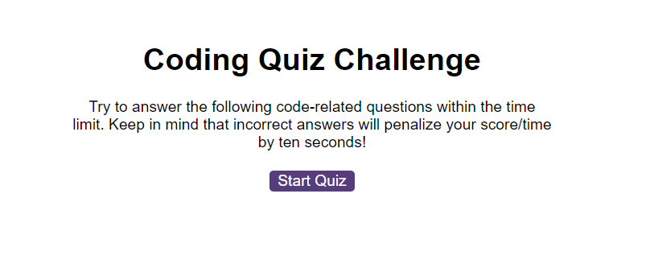
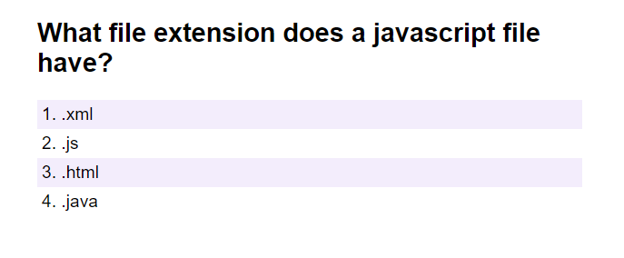
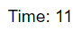
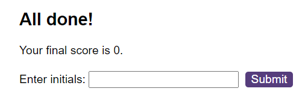

# code-quiz

## Description
A race against time to answer questions correctly on the topic, JavaScript. The more questions the user answers correctly, the higher the points.

https://jc6991.github.io/code-quiz

## Table of Contents
- [Installation](#Installation)
- [Usage](#Usage)
- [Credits](#Credits)
- [License](#License)

## Installation
N/A

## Usage
The below image shows the start screen that the user faces when the page loads. Upon clicking start quiz, the first question will be displayed.

The user faces multiple choice questions in a race against time. If the user answers a question correctly, they will increment their score by 1 point and move on to the next question. 

If they fail to answer a question correctly, they move on to the next question and recieve a 5 second time duduction, their score will not increment. 

The timer is displayed in the top of righ corner of the web page.

If the time runs out or the user answers all the questions, the end screen will be displayed where the user will see their final score.

They can submit their score along with their initials.

## Credits
N/A

## License
Please refer to the LICENSE in the repo.